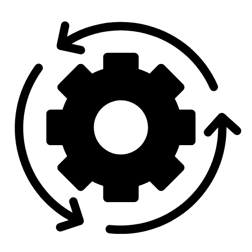

# Stremet — AI-Powered Manufacturing ERP

<p align="center">
  
</p>

Stremet is a smart factory management system built for steel and metal production facilities. It combines warehouse logistics, production tracking, and machine health monitoring into one platform — with an AI agent built in that helps operators, technicians, and supervisors get things done faster using natural language.

---

## Tech Stack

| Layer       | Technology                        |
|-------------|-----------------------------------|
| Backend     | Python, Django                    |
| Frontend    | HTML, CSS, Tailwind CSS, JavaScript |
| AI          | Google Gemini (Vertex AI)         |
| Database    | SQLite (local) / PostgreSQL (production) |
| Hosting     | Railway (planned)                 |

---

## What Can the AI Agent Do?

The AI agent lives inside the app as a chat assistant. Depending on who you are (your role), it has access to different skills and commands — over 40 tools in total. Here is what it can help with at a high level:

### Warehouse Management
- Track incoming deliveries and find the best shelf to store them
- Plan forklift routes through the warehouse
- Forecast how much space is left and when you will run out
- Generate shift handoff reports so the next crew knows what happened
- Detect anomalies like capacity warnings or stale deliveries

### Machine Health & Maintenance
- Monitor the health of every machine on the floor
- Predict when a machine is likely to fail before it happens
- Schedule and log maintenance (preventive, corrective, inspections)
- Correlate defects with specific machines to find root causes
- Track equipment details like wear level, parts, and purchase history

### Production Pipeline
- Start, pause, and resume production orders
- Control simulation speed and error rates for testing
- Track quality results (pass/fail), energy usage, and scrap rates
- View completed and defected products in real time
- Get a full production overview with trends and KPIs

### Smart Reporting
- Daily briefings tailored to your role
- Shift handoff summaries
- Anomaly detection and priority queues
- Searchable event logs across the entire facility

---

## User Roles

Stremet has **3 user roles**, each with a different view of the system and a different set of AI skills:

### 1. Warehouse Operator
The person on the ground. They receive deliveries, store materials on shelves, and keep the warehouse organized. The AI helps them find open shelf spots, plan efficient routes, and stay on top of what is coming in.

### 2. Maintenance Technician
Keeps the machines running. They log maintenance work, monitor machine health, and investigate defects. The AI gives them predictive insights — which machines need attention, what is degrading, and what maintenance to schedule next.

### 3. Production Supervisor
Oversees everything. They manage manufacturing orders, control the production pipeline, and have access to all warehouse and machine data. The AI gives them the full picture — cross-domain briefings, production analytics, and direct control over the pipeline.

---

## AI Skills by Role

| Skill Category | Operator | Technician | Supervisor |
|----------------|----------|------------|------------|
| Search deliveries, orders, materials | Yes | Yes | Yes |
| View machine health & warehouse stats | Yes | Yes | Yes |
| Search logs & scrap events | Yes | Yes | Yes |
| Store deliveries on shelves | Yes | — | Yes |
| Forklift route planning | Yes | — | Yes |
| Capacity forecasting | Yes | — | Yes |
| Log & edit maintenance entries | — | Yes | Yes |
| Reset machines & update thresholds | — | Yes | Yes |
| Predictive maintenance | — | Yes | Yes |
| Equipment detail lookup | — | Yes | Yes |
| Start/pause/resume production | — | — | Yes |
| Control pipeline speed & error rates | — | — | Yes |
| Production analytics & KPIs | — | — | Yes |
| Daily briefings & shift reports | Yes | Yes | Yes |
| Anomaly detection | Yes | — | Yes |

---

## Deployment

### Local Development (Current)
Right now, Stremet runs locally using **SQLite** as the database. This is great for development and demos — everything lives on your machine, no setup needed beyond Python and Django.

### Production on Railway (Planned)
For the public version, we will deploy on **Railway**. Railway handles both:

- **Hosting** — runs the Django app in the cloud so anyone can access it
- **Database** — provides a managed **PostgreSQL** database that replaces SQLite

This means switching from a local file-based database to a cloud database. Django makes this easy — we just update the database settings to point to Railway's PostgreSQL URL, and everything else stays the same.

---

## Getting Started Locally

```bash
# Clone the repo
git clone https://github.com/your-username/Hackathon_stremet.git
cd Hackathon_stremet

# Create a virtual environment and install dependencies
python -m venv .venv
source .venv/bin/activate
pip install django google-genai

# Run migrations and seed test data
cd metalerp
python manage.py migrate
python manage.py seed_data

# Start the server
python manage.py runserver
```

Then open [http://localhost:8000](http://localhost:8000) and pick your role to get started.
